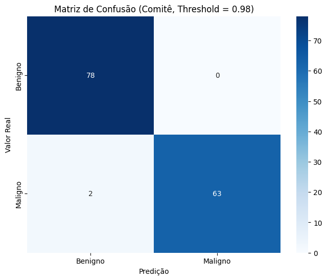
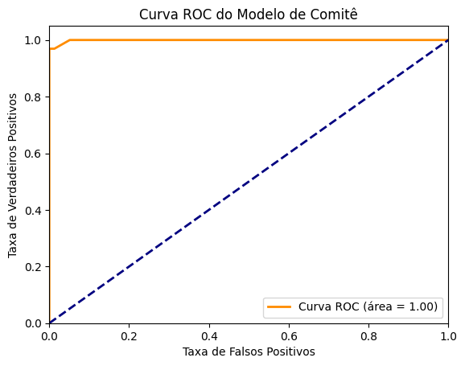

- **Câncer de Mama (Previsão)**:
    - Junta um trio de modelos (Random Forest, Rede Neural Profunda, Regressão Logistica) para prever, por meio de dados em um dataset .csv, o câncer de mama em pacientes, fazendo também uma limpeza de dados e uma augmentação de dados para a melhor previsão em casos de pacientes do gênero masculino, considerando a raridade da doença para homens.

      - **Curva ROC do Modelo Comitê:** A curva ROC (Receiver Operating Characteristic) é utilizada para avaliar o desempenho do modelo ao variar o threshold de classificação. A área sob a curva (AUC) indica a capacidade do modelo em diferenciar entre classes malignas e benignas, sendo uma AUC próxima de 1 um sinal de excelente desempenho.
      - **Matriz de Confusão:** A matriz de confusão exibe o desempenho do modelo Comitê, mostrando a quantidade de acertos e erros nas predições. As classes "Benigno" e "Maligno" estão indicadas nos eixos, e os valores nas células indicam o número de pacientes corretamente e incorretamente classificados.

