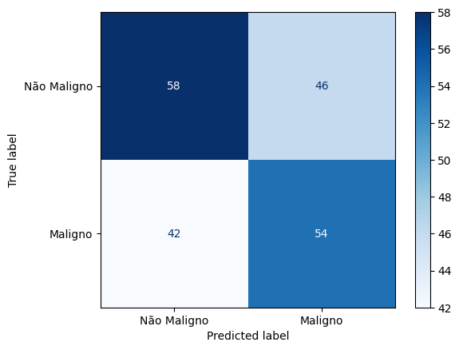
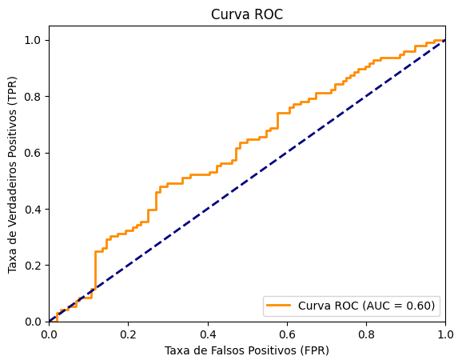

- **Melanoma Detecção**:
     - Utiliza de uma rede neural profunda de convolução DenseNet121 com pesos treinados da imagenet para detectar se manchas na pele são melanoma ou não.

       - **Curva ROC do Modelo Comitê:** A curva ROC (Receiver Operating Characteristic) avalia o desempenho do modelo ao variar o threshold de classificação. A área sob a curva (AUC) indica a capacidade do modelo em distinguir entre melanoma e não melanoma. No caso deste modelo, a AUC de 0.602 indica uma leve superioridade sobre uma classificação aleatória (50%), sugerindo espaço para melhorias.
       - **Matriz de Confusão:** A matriz de confusão apresenta o desempenho do modelo com base em um threshold de 0.5, exibindo a quantidade de verdadeiros positivos, verdadeiros negativos, falsos positivos e falsos negativos. Esses valores são essenciais para avaliar as métricas de sensibilidade e especificidade.

