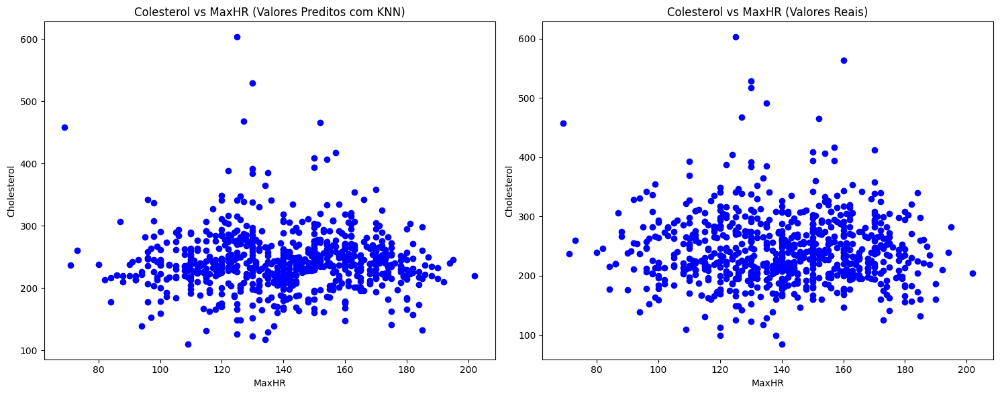

- **Preenchimento de Dados de Colesterol Faltante**:
     - Utiliza diversas técnicas para preencher dados faltantes, desde utilizar a técnica de K-nearest neighbors até treinar uma random forest para os preencher, garantindo resultados com propriedades similares ao esperado.

       - **Comparação entre Valores Preditos com KNN e Valores Reais:** A imagem apresenta dois gráficos que comparam a relação entre colesterol e a maior frequência cardíaca atingida (MaxHR). O primeiro gráfico mostra os valores preditos pelo modelo K-Nearest Neighbors (KNN), enquanto o segundo exibe os valores reais. Observa-se que o modelo KNN conseguiu capturar um padrão mais próximo do esperado, evidenciando a relação entre os atributos.

