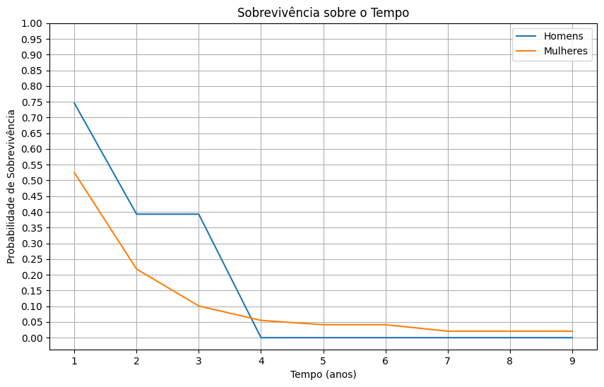
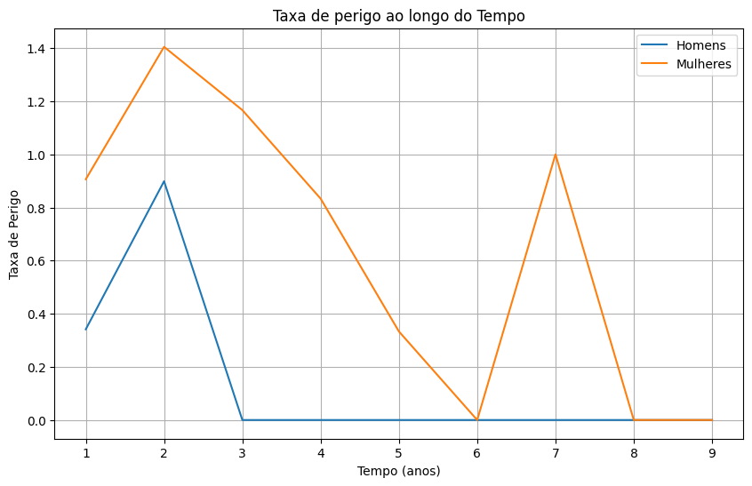
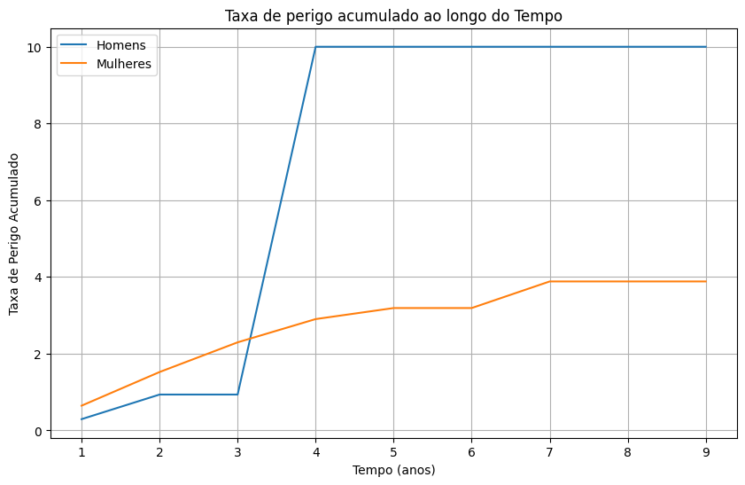

- **Probabilidade de Sobrevivência Câncer de Mama**:
  - Utiliza equações de probabilidade de sobrevivência para analisar a sobrevivência de pacientes ao longo dos anos após o último tratamento ou cirurgia. O projeto emprega técnicas de limpeza de dados e ampliação do dataset, considerando seu tamanho reduzido.

  - **Imagens Geradas:**
    - **Sobrevivência sobre o Tempo**: Esta imagem apresenta a curva de sobrevivência baseada no Estimador de Kaplan-Meier. Ela mostra a probabilidade de sobrevivência dos pacientes ao longo do tempo, comparando homens e mulheres. 
    - **Taxa de Perigo**: O gráfico ilustra a taxa de risco (hazard rate) ao longo do tempo. Um aumento na taxa indica momentos de maior probabilidade de mortalidade, fornecendo insights sobre períodos críticos para os pacientes.
    - **Taxa de Perigo Acumulado**: Este gráfico mostra a taxa de perigo acumulado ao longo do tempo. Ele evidencia que, para os homens, após quatro anos, o risco de morte atinge um patamar crítico, enquanto para as mulheres o perigo segue crescendo até se estabilizar por volta de sete anos.

