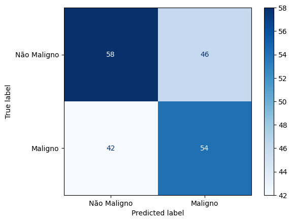
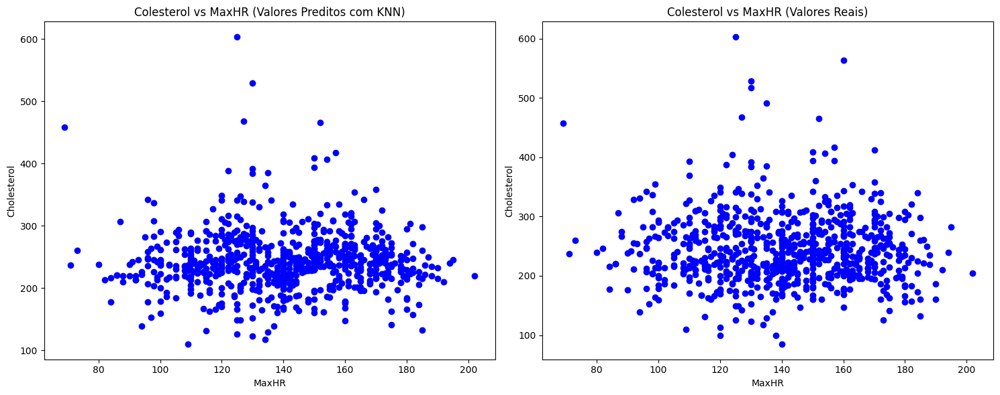
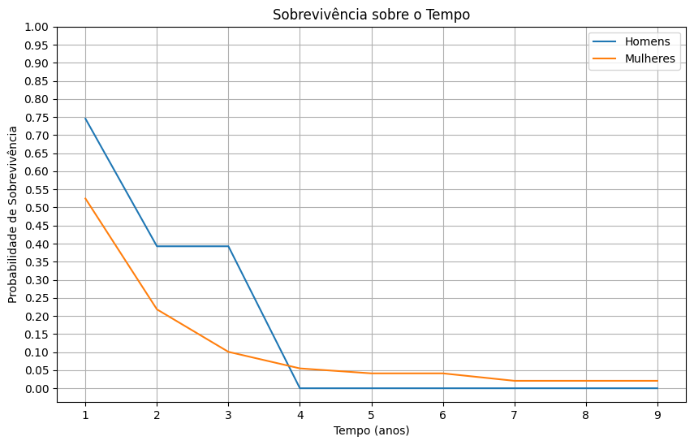
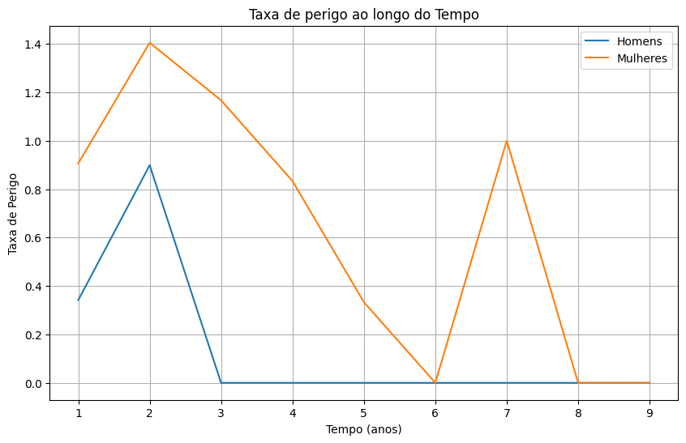
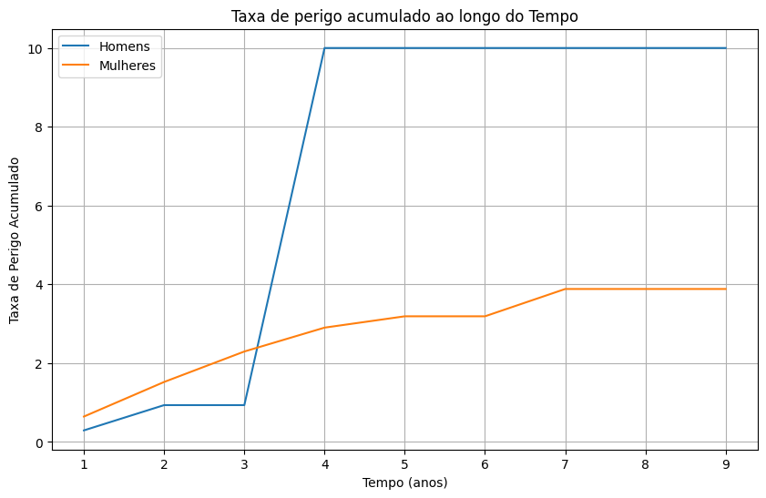

- **Câncer de Mama (Previsão)**:
    - Junta um trio de modelos (Random Forest, Rede Neural Profunda, Regressão Logistica) para prever, por meio de dados em um dataset .csv, o câncer de mama em pacientes, fazendo também uma limpeza de dados e uma augmentação de dados para a melhor previsão em casos de pacientes do gênero masculino, considerando a raridade da doença para homens.

      - **Curva ROC do Modelo Comitê:** A curva ROC (Receiver Operating Characteristic) é utilizada para avaliar o desempenho do modelo ao variar o threshold de classificação. A área sob a curva (AUC) indica a capacidade do modelo em diferenciar entre classes malignas e benignas, sendo uma AUC próxima de 1 um sinal de excelente desempenho.
      - **Matriz de Confusão:** A matriz de confusão exibe o desempenho do modelo Comitê, mostrando a quantidade de acertos e erros nas predições. As classes "Benigno" e "Maligno" estão indicadas nos eixos, e os valores nas células indicam o número de pacientes corretamente e incorretamente classificados.

/Matriz de Confusão Comitê.png)
/curva ROC.png)

- **Melanoma Detecção**:
     - Utiliza de uma rede neural profunda de convolução DenseNet121 com pesos treinados da imagenet para detectar se manchas na pele são melanoma ou não.

       - **Curva ROC do Modelo Comitê:** A curva ROC (Receiver Operating Characteristic) avalia o desempenho do modelo ao variar o threshold de classificação. A área sob a curva (AUC) indica a capacidade do modelo em distinguir entre melanoma e não melanoma. No caso deste modelo, a AUC de 0.602 indica uma leve superioridade sobre uma classificação aleatória (50%), sugerindo espaço para melhorias.
       - **Matriz de Confusão:** A matriz de confusão apresenta o desempenho do modelo com base em um threshold de 0.5, exibindo a quantidade de verdadeiros positivos, verdadeiros negativos, falsos positivos e falsos negativos. Esses valores são essenciais para avaliar as métricas de sensibilidade e especificidade.

- **Preenchimento de Dados de Colesterol Faltante**:
     - Utiliza diversas técnicas para preencher dados faltantes, desde utilizar a técnica de K-nearest neighbors até treinar uma random forest para os preencher, garantindo resultados com propriedades similares ao esperado.

       - **Comparação entre Valores Preditos com KNN e Valores Reais:** A imagem apresenta dois gráficos que comparam a relação entre colesterol e a maior frequência cardíaca atingida (MaxHR). O primeiro gráfico mostra os valores preditos pelo modelo K-Nearest Neighbors (KNN), enquanto o segundo exibe os valores reais. Observa-se que o modelo KNN conseguiu capturar um padrão mais próximo do esperado, evidenciando a relação entre os atributos.

- **Probabilidade de Sobrevivência Câncer de Mama**:
  - Utiliza equações de probabilidade de sobrevivência para analisar a sobrevivência de pacientes ao longo dos anos após o último tratamento ou cirurgia. O projeto emprega técnicas de limpeza de dados e ampliação do dataset, considerando seu tamanho reduzido.

  - **Imagens Geradas:**
    - **Sobrevivência sobre o Tempo**: Esta imagem apresenta a curva de sobrevivência baseada no Estimador de Kaplan-Meier. Ela mostra a probabilidade de sobrevivência dos pacientes ao longo do tempo, comparando homens e mulheres. 
    - **Taxa de Perigo**: O gráfico ilustra a taxa de risco (hazard rate) ao longo do tempo. Um aumento na taxa indica momentos de maior probabilidade de mortalidade, fornecendo insights sobre períodos críticos para os pacientes.
    - **Taxa de Perigo Acumulado**: Este gráfico mostra a taxa de perigo acumulado ao longo do tempo. Ele evidencia que, para os homens, após quatro anos, o risco de morte atinge um patamar crítico, enquanto para as mulheres o perigo segue crescendo até se estabilizar por volta de sete anos.

- **Risco de Ataque Cardíaco (Prognóstico)**:
  - Analisa os resultados de um modelo de regressão logística utilizando um conjunto de dados com diversas variáveis, identificando quais possuem maior significância para o prognóstico. O melhor modelo é escolhido com base na análise da curva ROC e na avaliação das matrizes de confusão. 
  - Este é o caso analisado com as melhores 9 variáveis, combinando informações cruciais sobre fatores de risco como frequência cardíaca máxima alcançada, indicador de isquemia miocárdica, tipo de dor no peito, angina induzida por exercício e número de artérias coronárias afetadas. Além disso, foram criadas 5 combinações entre variáveis correlacionadas, como:
    - **cp × exng**: Relação entre tipo de dor no peito e angina induzida por exercício.
    - **thalachh × exng**: Frequência cardíaca máxima em relação à angina.
    - **thalachh × oldpeak**: Frequência cardíaca e indicador de isquemia.
    - **thalachh × cp**: Frequência cardíaca e tipo de dor no peito.
    - **oldpeak × exng**: Relação entre isquemia miocárdica e angina induzida.

  - **Imagens Geradas:**
    - **Matriz de Confusão**: Representa a precisão do modelo ao classificar corretamente os casos de ataque cardíaco e não ataque cardíaco. Mostra a quantidade de verdadeiros positivos, verdadeiros negativos, falsos positivos e falsos negativos.
    - **Curva ROC**: Exibe a performance do modelo ao longo de diferentes limiares de decisão. A área sob a curva (AUC) é um indicador da qualidade do modelo, quanto maior, melhor a capacidade preditiva.

/Matriz Confusão.png)
/Curva ROC.png)

- **Segmentação do Átrio Esquerdo**:
  - O projeto utiliza a arquitetura U-Net para realizar a segmentação do átrio esquerdo a partir de imagens de ressonância magnética (MRI). Os dados foram obtidos do **Medical Segmentation Decathlon**, e a implementação foi baseada em cursos de diagnóstico por IA.

  - **Imagens Geradas:**
    - **Imagem Real do Átrio Esquerdo**: Representa a segmentação manual feita por especialistas para referência no treinamento do modelo.
    - **Imagem Predita pelo Modelo**: Segmentação gerada pela U-Net treinada, utilizada para comparação com a imagem real e avaliação da precisão do modelo.

  - **Resultados e Considerações:**
    - O modelo apresentou um **Coeficiente Dice de 0.3950 no treino** e **0.7248 na validação**.
    - A segmentação foi capaz de capturar padrões no MRI, mas ainda apresenta dificuldades em identificar corretamente o átrio esquerdo.
    - Algumas possíveis melhorias incluem **aumentar a profundidade do modelo, modificar a arquitetura e utilizar Data Augmentation**.
    - A proporção reduzida do átrio esquerdo nas imagens pode ter dificultado o aprendizado do modelo, pois em muitos casos apenas **3% dos píxeis** continham informações relevantes.

  - Apesar dos desafios, os resultados indicam que o modelo capturou algumas informações relevantes e pode ser aprimorado com ajustes na estrutura e no processamento dos dados.

/Valor Predito.png)
/Valor Real.png)

Todos os exemplos são melhor explicados e detalhados em seus respectivos arquivos .ipynb, que também contêm a fonte original dos dados utilizados. Os dados não são de minha autoria, mas são disponibilizados publicamente para fins de pesquisa não comerciais.
