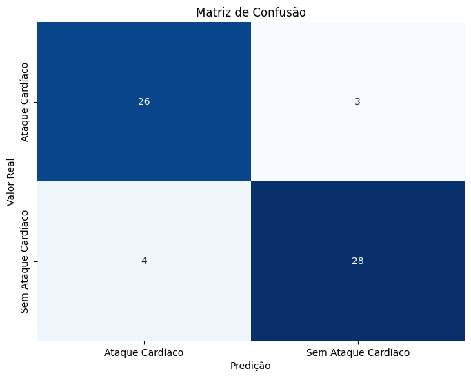
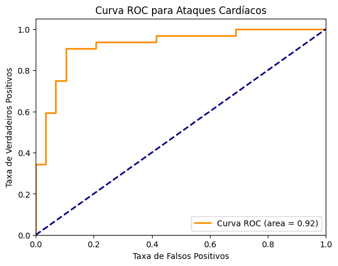

- **Risco de Ataque Cardíaco (Prognóstico)**:
  - Analisa os resultados de um modelo de regressão logística utilizando um conjunto de dados com diversas variáveis, identificando quais possuem maior significância para o prognóstico. O melhor modelo é escolhido com base na análise da curva ROC e na avaliação das matrizes de confusão. 
  - Este é o caso analisado com as melhores 9 variáveis, combinando informações cruciais sobre fatores de risco como frequência cardíaca máxima alcançada, indicador de isquemia miocárdica, tipo de dor no peito, angina induzida por exercício e número de artérias coronárias afetadas. Além disso, foram criadas 5 combinações entre variáveis correlacionadas, como:
    - **cp × exng**: Relação entre tipo de dor no peito e angina induzida por exercício.
    - **thalachh × exng**: Frequência cardíaca máxima em relação à angina.
    - **thalachh × oldpeak**: Frequência cardíaca e indicador de isquemia.
    - **thalachh × cp**: Frequência cardíaca e tipo de dor no peito.
    - **oldpeak × exng**: Relação entre isquemia miocárdica e angina induzida.

  - **Imagens Geradas:**
    - **Matriz de Confusão**: Representa a precisão do modelo ao classificar corretamente os casos de ataque cardíaco e não ataque cardíaco. Mostra a quantidade de verdadeiros positivos, verdadeiros negativos, falsos positivos e falsos negativos.
    - **Curva ROC**: Exibe a performance do modelo ao longo de diferentes limiares de decisão. A área sob a curva (AUC) é um indicador da qualidade do modelo, quanto maior, melhor a capacidade preditiva.

