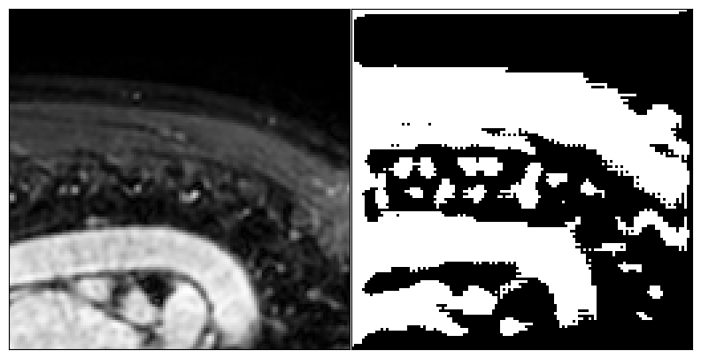
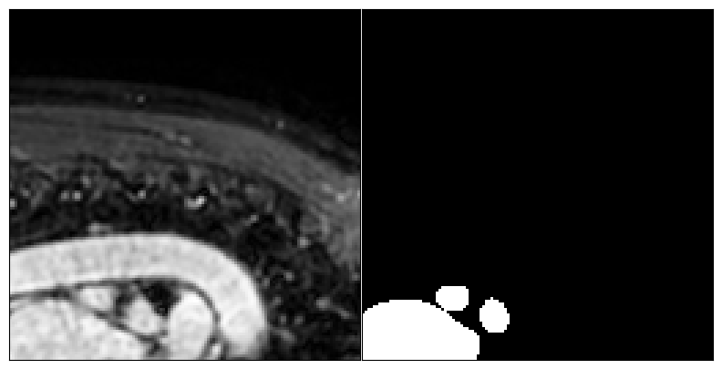

- **Segmentação do Átrio Esquerdo**:
  - O projeto utiliza a arquitetura U-Net para realizar a segmentação do átrio esquerdo a partir de imagens de ressonância magnética (MRI). Os dados foram obtidos do **Medical Segmentation Decathlon**, e a implementação foi baseada em cursos de diagnóstico por IA.

  - **Imagens Geradas:**
  - **Imagem Predita pelo Modelo**: Segmentação gerada pela U-Net treinada, utilizada para comparação com a imagem real e avaliação da precisão do modelo.

    - **Imagem Real do Átrio Esquerdo**: Representa a segmentação manual feita por especialistas para referência no treinamento do modelo.
    
  - **Resultados e Considerações:**
    - O modelo apresentou um **Coeficiente Dice de 0.3950 no treino** e **0.7248 na validação**.
    - A segmentação foi capaz de capturar padrões no MRI, mas ainda apresenta dificuldades em identificar corretamente o átrio esquerdo.
    - Algumas possíveis melhorias incluem **aumentar a profundidade do modelo, modificar a arquitetura e utilizar Data Augmentation**.
    - A proporção reduzida do átrio esquerdo nas imagens pode ter dificultado o aprendizado do modelo, pois em muitos casos apenas **3% dos píxeis** continham informações relevantes.

  - Apesar dos desafios, os resultados indicam que o modelo capturou algumas informações relevantes e pode ser aprimorado com ajustes na estrutura e no processamento dos dados.

Todos os exemplos são melhor explicados e detalhados em seus respectivos arquivos .ipynb, que também contêm a fonte original dos dados utilizados. Os dados não são de minha autoria, mas são disponibilizados publicamente para fins de pesquisa não comerciais.
